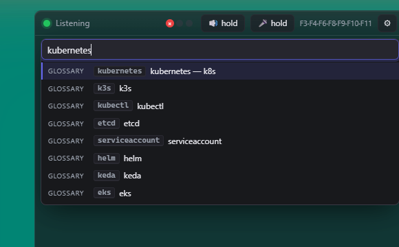
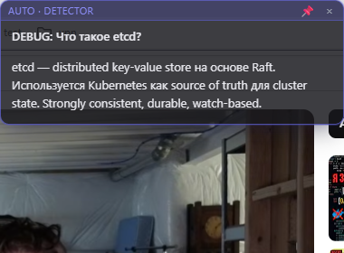
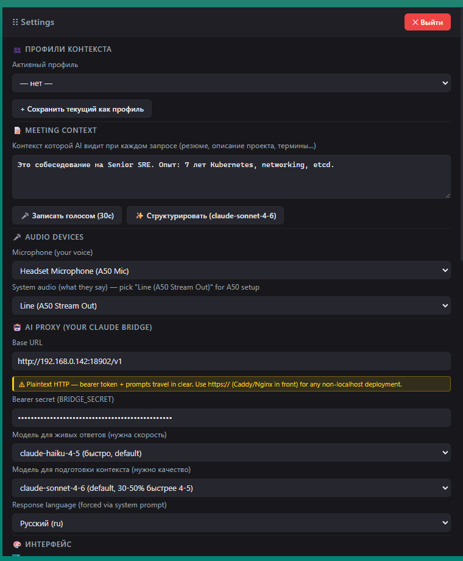

# suflyor

Личный AI-overlay для технических собесов под Windows. Слушает звук, транскрибирует через Whisper, спрашивает Claude, показывает ответ во второстепенном окошке.

Pet project, **v0.0.67**. Под одного пользователя. Без code signing, без telemetry. **🇷🇺 Русский / 🇬🇧 English** UI с переключением на лету.


Тонкий transparent бар сверху: статус Listening, 3 HUD-dot (audio/stt/ai), push-to-talk кнопки для mic и system audio, hotkey подсказка, шестерёнка Settings.

### F4 — Knowledge Base palette (1643 entries)



Поиск по embedded базе (glossary + commands + patterns). Enter → tile с найденным контентом на второстепенном мониторе (или primary, если он один). Без AI-вызова, $0.

### Tile card (Q/A на второстепенном мониторе)



Header показывает источник (AUTO · DETECTOR / MIC / SYSTEM / MANUAL — цветовая кодировка), вопрос как заголовок, ответ с ReactMarkdown + GFM. 📌 — pin (отключает TTL), × — закрыть. Esc тоже закрывает (v0.0.11). Размер 380×280 px минимум, авто-расширяется до 400 после рендера markdown. Transparent — фон видно сквозь карточку (опционально stealth-режим в Settings).

### Settings (⚙ или tray)



Перетаскивается за заголовок «⋮⋮ Settings». ✕ Выйти — quit с подтверждением + auto-stop активной сессии (журнал закрывается с SessionSummary). 13 секций: профили контекста, meeting context, audio devices, AI proxy (с проверкой моста + cost cap), интерфейс, stealth, coaching, auto-tiles, knowledge base, snippets, STT, hotkeys, обновления (скрол).

### 🌐 Bilingual UI — RU + EN (v0.0.42–v0.0.50)

Settings → 🎨 Интерфейс → 🇷🇺 Русский / 🇬🇧 English → Save. Переключение **на лету** — overlay/tiles/Replay re-render без перезапуска. Бэкенд хранит `ui_language` в `%APPDATA%\overlay-mvp\config.json` (`"ru"` по умолчанию, forward-compat для старых конфигов).

Покрытие: каждая видимая UI-строка (header/footer/sidebar/13 панелей Settings, overlay bar со статусом + чипами + push-to-talk + ℹ popover с 8 хоткеями и 9 индикаторами, tile chrome — pin/close/source label, Replay viewer). Технические лейблы в Replay (`model=`, `ms`, `finish=`) намеренно оставлены универсальными — это field names JSONL-журнала.

Не переведены: snippet CRUD modal (редко открываемый), tray menu (Rust-side rebuild только при запуске).

### 🆙 Update button (v0.0.2+)

Settings → 🆙 Обновления → «🔍 Проверить обновления». Запрос на GitHub Releases API (~1 KB JSON), если есть новее — показывает release notes + кнопка «⬇ Открыть страницу скачивания» (в браузере). Без auto-install — пользователь сам жмёт MSI.

### 📊 Session Replay viewer

Footer Settings → «📊 Session Replay» (или прямо `?replay=1` в URL) — таймлайн всех событий из JSONL-журналов в `%APPDATA%\overlay-mvp\sessions\`. Выбираешь сессию из dropdown'а, видишь:

- transcript_line (mic/system, цветовая кодировка)
- detector_decision (triggered ✓ / skipped)
- ai_request / ai_response (с моделью и токенами)
- tile_spawn (kind + question)
- session_summary (длительность, AI-вызовов, $)

Фильтр-чипы вверху (v0.0.11+) скрывают отдельные kind'ы — полезно когда транскрипт зашумляет таймлайн. v0.0.14+ чипы color-coded по kind'у (совпадают с border'ами строк ниже).

### 📊 Диагностический дамп (v0.0.15+)

Settings → 🆙 Обновления → «📊 Диагностический дамп». Один клик — sanitized .md на Desktop:
- Config без секретов (groq_api_key, ai_bearer, ai_base_url, meeting_context, profiles обнулены)
- App version + OS/arch
- Последние 50 строк свежего journal (v0.0.16 redacts gsk_/Bearer/sk- паттерны)
- Crash report (если был startup panic)

Прикладывай к bug report'у вместо ручного поиска в AppData + редактирования секретов.

## Установка

1. Скачать MSI из [Releases](https://github.com/PavelLizunov/suflyor/releases)
2. Запустить — SmartScreen скажет «Unknown publisher» → More info → Run anyway
3. Создать `%APPDATA%\overlay-mvp\config.json`:

```json
{
  "groq_api_key": "gsk_…",
  "ai_bearer": "<BRIDGE_SECRET>",
  "ai_base_url": "http://127.0.0.1:18902/v1",
  "ai_model": "claude-haiku-4-5",
  "prep_model": "claude-sonnet-4-6",
  "stt_model": "whisper-large-v3",
  "response_language": "ru",
  "mic_device": null,
  "system_audio_device": null
}
```

4. Запустить «suflyor» из Start Menu. Подкрутить устройства через Settings (⚙).

## Hotkeys

| | |
|---|---|
| F3 | Reask последнего вопроса |
| F4 | KB palette (поиск 1643 entries) |
| F6 | Manual tile из последней реплики |
| F8 | Pause/resume сессии |
| F9 | Ask AI |
| F10 | Screenshot для следующего ask |
| F11 | **PANIC HIDE** — скрыть overlay+tiles |

## Stack

Tauri 2 + React 19 + Rust. Groq Whisper Large v3 для STT. Claude через OpenAI-compat OAuth-bridge (с auto-retry на 5xx и cost cap per session). WASAPI loopback для системного звука.

## Defaults

- `max_session_cost_usd` = **0 (выкл) с v0.0.28** — раньше дефолт был 1.00 USD soft-warn, но pet-project юзер сказал «по костам не важно». Любое положительное число включит жёлтый 💰 чип в overlay когда сессия превысит сумму. AI всё равно НЕ блокируется (soft warning since v0.0.5).
- `detector_skip_mic` = true — auto-tile не спавнится на твоём голосе (только на репликах собеседника). Отключи если хочешь подсказки по обеим сторонам.
- `post_meeting_debrief_enabled` = false — opt-in. Один Sonnet вызов в конце сессии для 3-point speech coaching.
- `stealth_enabled` = false — overlay виден в screen-share. Включи в Settings → 🎯 Stealth если параноишь.
- `stt_model` = `whisper-large-v3` — самая точная Groq Whisper модель. Переключи в Settings на `whisper-large-v3-turbo` если важна низкая latency (≈3× быстрее, чуть хуже на редких терминах).
- `ai_model` = `claude-haiku-4-5` для живых ответов, `prep_model` = `claude-sonnet-4-6` для пре-meeting structuring и debrief.

## Robustness slots

- **Tile slot collision fix** (v0.0.5): каждый ActiveTile хранит свой `slot: usize`. Новый spawn ищет первый свободный slot через HashSet diff, не Vec.len() — фикс наложения после × закрытия middle tile.
- **AI retry** (v0.0.2): `complete_with_usage` делает 3 попытки с exponential backoff (1s/2s/4s) на 5xx/timeout. 4xx auth/quota → fail fast.
- **Bridge check** (v0.0.2): Settings → 🔌 Проверить мост → диагностический probe с человекочитаемыми hints («connection refused», «bearer rejected», «404 endpoint missing»).
- **Crash report** (v0.0.2): на startup panic пишет `%APPDATA%\overlay-mvp\crash-report.txt` вместо silent die.
- **Journal size cap** (v0.0.2): 500 MB total + 100 файлов retention.

## Лицензия

GPL-3.0
