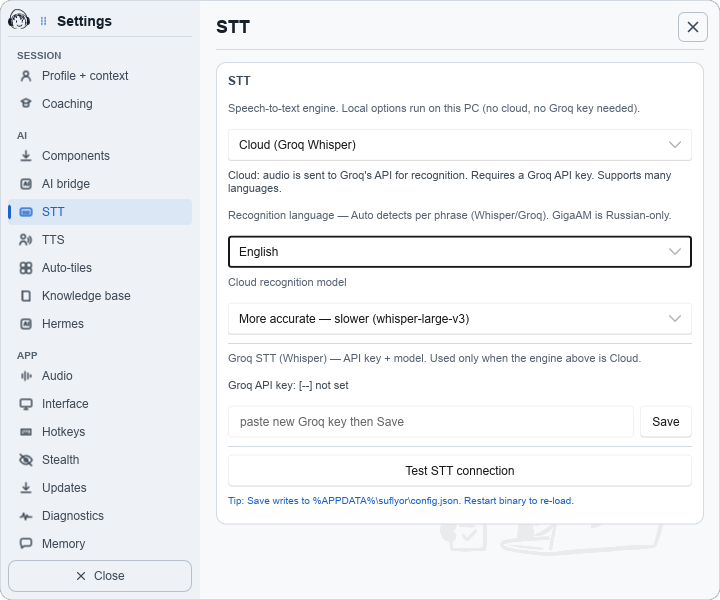
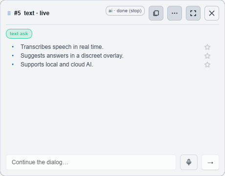
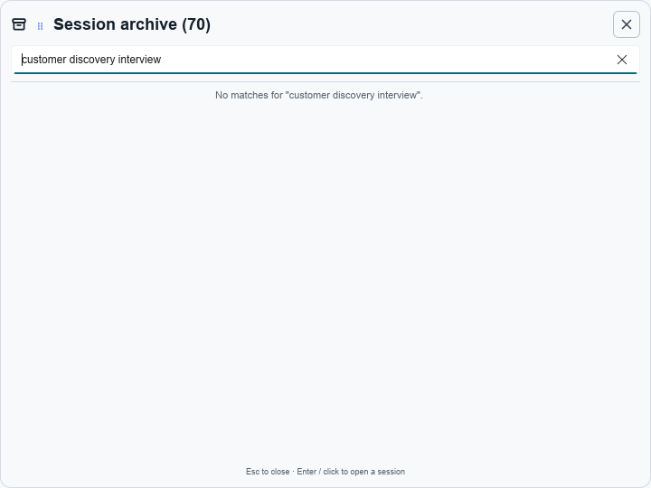

# Suflyor

A native Windows overlay with an active Apple Silicon macOS port. It listens to
meetings, transcribes speech in real time, and answers technical questions
through an LLM — cloud or fully local — in small floating windows ("tiles")
beside the meeting window.

Built in **pure Rust + [Slint](https://slint.dev)** (skia renderer, no browser
engine, no Node). Transparent, always-on-top, with Windows capture exclusion
available through an explicit stealth toggle.

**Published production installers target Windows 10/11 and Apple Silicon macOS
14.2+.** Single user, no telemetry. Interface languages: English and Russian
(switchable at runtime).

<!-- latest-release:start -->
Latest published build: [v0.38.0](https://github.com/PavelLizunov/suflyor/releases/tag/v0.38.0).
<!-- latest-release:end -->
The `master` branch may contain unreleased work.

## Screenshots

| | |
|---|---|
|  |  |
|  |  |
|  |  |
|  |  |

## Features

- **Cloud or local AI.** Use a cloud LLM (Claude via an OpenAI-compatible
  bridge) or install llama.cpp with an in-app choice of Gemma 4 E4B / 12B / 26B-A4B
  profiles (CUDA or CPU). Combine it with local STT for an offline meeting
  pipeline. The standalone PowerShell script installs the lightweight 4B
  profile.
- **Speech-to-text.** Cloud (Groq Whisper), local whisper.cpp server, or
  GigaAM-v3 running in-process. DirectML remains the Windows default; macOS
  defaults to CPU, with Core ML available as an opt-in. Groq and whisper.cpp
  support mixed Russian + English; GigaAM is the Russian specialist.
- **Transparent overlay bar.** Always-on-top HUD showing session status,
  live transcript, mic/system-audio toggles, timer, and action chips.
- **AI tiles.** Markdown-rendered answers with pin, maximize, copy, follow-up
  conversation, and adjustable opacity.
- **Auto-tiles.** Question/keyword detector in the transcript spawns answer
  tiles automatically (configurable; can skip your own mic input).
- **Meeting summary.** One-click structured summary of the full transcript.
  Long sessions are chunked and processed via map-reduce without truncation.
- **Audio recording.** Mic and system audio recorded to separate WAV files
  with a configurable retention policy. Offline re-transcription and summary
  rebuild from the archive.
- **Session archive (F7).** Full-text search (SQLite FTS5) across past
  sessions — transcripts and AI answers. Includes a built-in audio player
  with click-to-seek and per-line highlighting.
- **Personal memory.** Your facts, terms, and names (internal projects,
  abbreviations) injected into AI answers and summaries. Candidates extracted
  from sessions with manual review.
- **Vision AI (F8).** Select a screen region for analysis or description.
  **Shift+F8** translates the captured text. **Ctrl+F8** runs OCR for the
  read-aloud pipeline.
- **Read-aloud (TTS).** Neural text-to-speech via a separate sidecar process
  (sherpa-onnx). **Shift+Alt+1** reads selected text, **Shift+Alt+2** reads
  an OCR region, **Shift+Alt+3** pauses/resumes.
- **Speaker diarization.** Offline speaker segmentation (pyannote + WeSpeaker)
  through the TTS sidecar, available from the archive.
- **Knowledge base palette (F4).** A large built-in library (glossary, commands,
  patterns). Search and open as a tile — no AI call, zero cost.
- **Stealth mode.** Windows request capture exclusion through
  `WDA_EXCLUDEFROMCAPTURE`, used by modern Windows capture APIs. Capture
  software can vary, so verify it with your own meeting setup before relying
  on it.
- **Windows auto-update.** Checks GitHub Releases, downloads the installer,
  verifies its SHA-256 digest against the release metadata, and launches it.
  Verification is fail-closed, and downloads are restricted to GitHub hosts.
- **Hermes plugin.** Optional two-way integration with a local Hermes agent
  instance — install the plugin from Settings.
- **Context window control.** Auto / 8K / 16K / 32K / 64K / 96K presets for
  the managed local llama.cpp server, with hardware-aware memory estimates.

## Installation

### Windows

1. Download **`suflyor-slint-setup.exe`** from
   [GitHub Releases](https://github.com/PavelLizunov/suflyor/releases).
2. Run it. The binary is unsigned, so SmartScreen may warn:
   **More info → Run anyway**.
3. Installs to `%LOCALAPPDATA%\suflyor-slint\` — no admin rights required.
   A Start menu shortcut is created.
4. Launch the app. A seven-step wizard walks through cloud/local mode, AI,
   speech recognition, microphone, system audio, and overlay preferences.

Configuration is stored in `%APPDATA%\suflyor\config.json`.

### macOS (Apple Silicon)

Download the versioned `.dmg` from
[GitHub Releases](https://github.com/PavelLizunov/suflyor/releases) or build one
from source with the command below. Before the first launch, follow the complete
[macOS installation and permissions guide](docs/macos-install.md), also included
inside the DMG as `Install Suflyor.txt`. The published package is ad-hoc signed
and unnotarized, so Gatekeeper confirmation and explicit microphone/system-audio
permissions are required.

### Local AI (optional — everything on your PC)

From the app: **Settings → AI bridge → Install / complete local AI**. This downloads llama.cpp,
whisper.cpp, and models, detects your GPU (CUDA), starts the servers, and
writes the settings.

Or run the standalone script:

```powershell
powershell -ExecutionPolicy Bypass -File scripts\setup-local-ai.ps1
```

What gets installed (into `%USERPROFILE%\suflyor-local-ai`):

| Component | Role | Endpoint |
|---|---|---|
| llama.cpp + Gemma 4B | LLM | `http://127.0.0.1:8080/v1` |
| whisper.cpp + Whisper large-v3-turbo | STT (mixed RU+EN) | `http://127.0.0.1:8081/v1` |
| GigaAM-v3 | STT (best Russian) | in-process, no server |

Script flags: `-Cpu` (force CPU), `-NoLaunch` (download only),
`-SkipLlama` / `-SkipWhisper` / `-SkipGigaam`. Re-running resumes partial
downloads and skips completed components.

## First five minutes

1. Complete the first-launch wizard. Each hardware/service step has its own
   test, and **Settings → Diagnostics → Check all** is the single place to
   confirm the complete stack later.
2. Treat the long top bar as the control panel: microphone and speaker chips
   choose what Suflyor hears; **Start** begins a session; **+ tile** opens a
   manual answer window.
3. Speak normally. The second line of the bar shows the latest transcript and
   whether it came from your microphone or system audio. Automatic answers
   appear as tiles when question detection is enabled.
4. Press **F1** for the in-app help, or **F7** to search past
   sessions. Every shortcut is also listed in **Settings → Hotkeys**;
   **Settings → Diagnostics** shows whether each one registered successfully.

## Hotkeys

| Key | Action |
|---|---|
| **F1** | Toggle help window |
| **F3** | Re-ask the last question with fresh context |
| **F4** | Toggle knowledge base palette |
| **F6** | Manual tile from the last transcript line |
| **F7** | Toggle session archive |
| **F8** | Screenshot → Vision AI (select a region; Esc cancels) |
| **Shift+F8** | Screenshot → translate captured text |
| **Ctrl+F8** | Screenshot → OCR / read-aloud |
| **F9** | Ask the AI now (streaming answer) |
| **Shift+F9** | Ask with cloud escalation (deeper reasoning, one-shot) |
| **Shift+Alt+1** | Read selected text aloud (clipboard) |
| **Shift+Alt+2** | Read an OCR region aloud |
| **Shift+Alt+3** | Pause / resume read-aloud |

Push-to-talk: hold **ask** for your microphone or **grab** for system audio.

## Architecture

Three standalone crates (no root workspace):

```
slint-experiment/     overlay-host binary — Slint UI (ui/*.slint compiled
                      in via build.rs), Win32 transparency/stealth, hotkey
                      dispatch, tile lifecycle, settings orchestration

overlay-backend/      shared no-UI library — audio (WASAPI loopback + mic),
                      STT dispatch (Groq / whisper.cpp / GigaAM), AI client
                      (OpenAI-compatible, streaming, retry, cost tracking),
                      local AI installer, vision, OCR, TTS/diarization control,
                      journal, KB, memory, config, auto-update

suflyor-tts/          neural read-aloud + diarization worker — links
                      sherpa-onnx only; must stay a separate process (two
                      static onnxruntimes in one binary crash)
```

Data flow: WASAPI capture → STT → transcript ring buffer → question/keyword
detector → prompt build (with KB + memory injection) → AI (local or cloud) →
tile spawn on the UI thread.

Overlay windows use Win32 `WS_EX_LAYERED` / DWM blur-behind /
`SetWindowDisplayAffinity` for transparency, always-on-top, and stealth.

See [`docs/architecture.md`](docs/architecture.md) for the full developer
overview and [`CONTRIBUTING.md`](CONTRIBUTING.md) for the build setup.

## Privacy and security

- **No telemetry.** Nothing is collected or reported.
- **Local-first option.** When AI and STT are both local, meeting audio,
  transcripts, and prompts are processed on your machine.
- **Secrets stay local.** API keys are stored in
  `%APPDATA%\suflyor\config.json` and sent only to the services you configure.
  The app avoids logging secret values, and UI errors hide URLs and hosts.
- **Update downloads are verified.** The auto-updater only accepts GitHub-hosted
  assets and verifies the installer's SHA-256 digest against GitHub release
  metadata before execution. The installer is not Authenticode-signed.
- **Stealth is explicit.** Screen-capture exclusion is off by default and
  toggled in Settings.

## Limitations

- **No Linux build.** Supported native targets are Windows 10/11 and Apple
  Silicon macOS 14.2 or newer.
- **Platform signing warnings.** Windows builds are not Authenticode-signed;
  macOS builds are not notarized and use ad-hoc signing by default. An explicit
  stable local identity can preserve code identity across personal builds, but
  Gatekeeper still requires first-launch confirmation.
- **macOS capture permissions.** Microphone and system-audio capture remain
  subject to macOS TCC approval. Ad-hoc rebuilds or a changed signing identity
  can prompt again; verify every new build with the actual meeting devices.
- **Single user.** No multi-user profiles, no concurrent sessions.
- **GPU-dependent local AI quality.** The 26B Gemma profile needs a GPU with
  sufficient VRAM; CPU fallback uses smaller models.
- **Stealth vs. interaction.** Stealthed windows force an arrow cursor to
  avoid leaking the overlay's custom cursor into screen captures.
- **Capture exclusion is not a universal guarantee.** Test stealth with the
  exact meeting/recording software and Windows version you use.

## Building from source

Windows prerequisites: Windows 10/11, Rust (stable-msvc toolchain), Visual
Studio Build Tools 2022 with the C++ workload.

```powershell
# Dev build + run
cargo run --bin overlay-host --manifest-path slint-experiment\Cargo.toml

# Release build + NSIS installer
powershell -ExecutionPolicy Bypass -File scripts\build-slint-release.ps1 -Installer
# → slint-experiment\target\release\bundle\suflyor-slint-setup.exe

# Full CI gate
powershell -NoProfile -ExecutionPolicy Bypass -File scripts\ci.ps1
```

macOS prerequisites: Apple Silicon macOS 14.2+, Xcode command-line tools, Rust,
and the pinned Swift package dependencies already recorded by the repository.

```bash
./slint-experiment/scripts/build-macos-dmg.sh
# → slint-experiment/target/bundle/Suflyor-<version>-macos-arm64.dmg

# Optional personal-build identity stored in the macOS Keychain (exact SHA-1):
SUFLYOR_MACOS_SIGN_IDENTITY="<40-hex certificate SHA-1>" \
  ./slint-experiment/scripts/build-macos-dmg.sh
```

The explicit identity must already exist as a code-signing identity in the
login Keychain. Its private key is never stored in this repository.

## License

[GPL-3.0](LICENSE)

## Origin

Suflyor is a 100% vibe-coded product. The product owner has not manually read
or written a single line of its source code. Their role has been to choose the
stack, define the product direction, and make technical decisions. The
implementation was produced with Codex, Claude Code, and Qwen Code.
