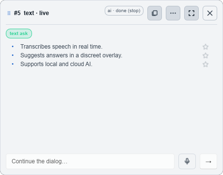

# Suflyor

A native meeting and interview assistant for Windows, with an active Apple
Silicon macOS port. It listens to a meeting, transcribes speech in real time
and answers technical questions through an LLM, cloud or fully local, in small
floating windows ("tiles") beside the meeting window.

<!-- latest-release:start -->
Latest published build: [v0.38.0](https://github.com/PavelLizunov/suflyor/releases/tag/v0.38.0).
<!-- latest-release:end -->
Download it from
[GitHub Releases](https://github.com/PavelLizunov/suflyor/releases).
The `master` branch may contain unreleased work.

Windows 10/11 and Apple Silicon macOS 14.2+. Single user, no telemetry.
Interface in English and Russian, switchable at runtime. Built in pure Rust and
[Slint](https://slint.dev): no browser engine, no Node.

More screenshots: [docs/showcase/](docs/showcase/).

## What it does

- **Cloud or local AI.** A cloud LLM through an OpenAI-compatible bridge, a
  managed llama.cpp with Gemma profiles (CUDA or CPU), or managed MLX on Apple
  Silicon.
- **Speech-to-text.** Groq Whisper in the cloud, a local whisper.cpp server, or
  GigaAM-v3 in-process for Russian.
- **Overlay bar.** Always on top: session status, live transcript, microphone
  and system-audio toggles, timer.
- **AI tiles.** Markdown answers with pin, maximize, copy and follow-up.
  A question detector can open them automatically.
- **Meeting summary.** One click; long sessions are processed in chunks.
- **Recording and archive (F7).** Microphone and system audio as separate WAV
  files, full-text search over past sessions, a player with click-to-seek.
- **Personal memory.** Your terms and names are injected into answers.
  Candidates found in sessions wait for your review.
- **Vision (F8).** Analyse, translate or read aloud a screen region.
- **Read-aloud and speaker diarization** in a separate sidecar process.
- **Knowledge base (F4).** A built-in glossary, commands and patterns; no AI
  call.
- **Stealth mode.** Asks Windows to exclude the overlay from screen capture.
  Off by default; test it with your own meeting software before relying on it.
- **Windows auto-update.** Downloads the installer from GitHub only and checks
  its SHA-256 against the release metadata before running it.

## Install

### Windows

1. Download `suflyor-slint-setup.exe` from
   [GitHub Releases](https://github.com/PavelLizunov/suflyor/releases).
2. Run it. The binary is unsigned, so SmartScreen may warn: **More info**,
   then **Run anyway**.
3. It installs to `%LOCALAPPDATA%\suflyor-slint\` without admin rights.
4. Launch the app. A seven-step wizard sets up AI, speech recognition,
   microphone and system audio.

Settings live in `%APPDATA%\suflyor\config.json`. In **Settings, Audio** you
choose the microphone and the playback device Suflyor captures; a change
applies to the next session.

### macOS (Apple Silicon)

Download the `.dmg` from
[GitHub Releases](https://github.com/PavelLizunov/suflyor/releases) and follow
the [macOS installation and permissions guide](docs/macos-install.md) before
the first launch. The package is ad-hoc signed and not notarized, so Gatekeeper
asks for confirmation.

### Local AI (optional)

**Settings, AI bridge, Install / complete local AI** downloads llama.cpp,
whisper.cpp and the models, detects a CUDA GPU, starts the servers and writes
the settings, with a choice of model size. On Apple Silicon choose **Managed
MLX**. A standalone Windows script installs the lightest profile; see
[scripts/README.md](scripts/README.md).

## First five minutes

1. Finish the first-launch wizard. **Settings, Diagnostics, Check all**
   confirms the whole stack later.
2. The long top bar is the control panel: the microphone and speaker chips
   choose what Suflyor hears, **Start** begins a session, **+ tile** opens a
   manual answer.
3. Speak normally. The bar shows the latest transcript line and its source.
4. Press **F1** for help.

## Hotkeys

| Key | Action |
|---|---|
| **F1** | Help |
| **F3** | Re-ask the last question |
| **F4** | Knowledge base |
| **F6** | Manual tile |
| **F7** | Session archive |
| **F8** | Screen region to Vision AI |
| **Shift+F8** | Translate a screen region |
| **Ctrl+F8** | OCR and read aloud |
| **F9** | Ask the AI now |
| **Shift+F9** | Ask with cloud escalation |
| **Shift+Alt+1** | Read selected text aloud |
| **Shift+Alt+2** | Read an OCR region aloud |
| **Shift+Alt+3** | Pause or resume read-aloud |

All of them are listed in **Settings, Hotkeys**.

## Privacy

- **No telemetry.** Nothing is collected or reported.
- **Local-first option.** With local AI and local speech recognition, audio,
  transcripts and prompts stay on your machine.
- **Secrets stay local.** API keys are stored in `config.json` and sent only to
  the services you configure.
- **Updates are verified** against GitHub release metadata. The installer is
  not Authenticode-signed.

## Limits

- No Linux build.
- Windows builds are unsigned; macOS builds are not notarized.
- macOS asks for microphone and system-audio permission, and may ask again
  after an update.
- One user, one session at a time.
- The largest local model needs a GPU with enough memory.
- Capture exclusion is not a guarantee on every recorder.

## More

- User guide (Russian): [docs/GUIDE.md](docs/GUIDE.md)
- Updating and going back a version: [UPGRADING.md](UPGRADING.md)
- Developer overview: [docs/architecture.md](docs/architecture.md)
- Building from source: [CONTRIBUTING.md](CONTRIBUTING.md)
- Reporting a vulnerability: [SECURITY.md](SECURITY.md)

## License

[GPL-3.0](LICENSE)

## Origin

Suflyor is a 100% vibe-coded product. The product owner has not manually read
or written a single line of its source code. Their role has been to choose the
stack, define the product direction, and make technical decisions. The
implementation was produced with Codex, Claude Code, and Qwen Code.
