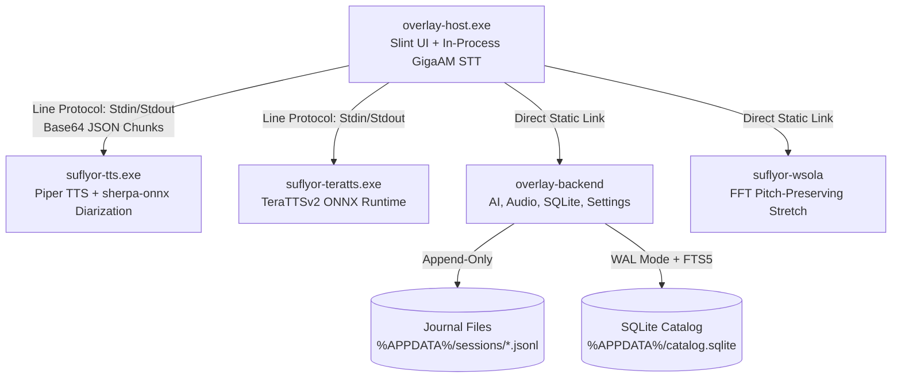
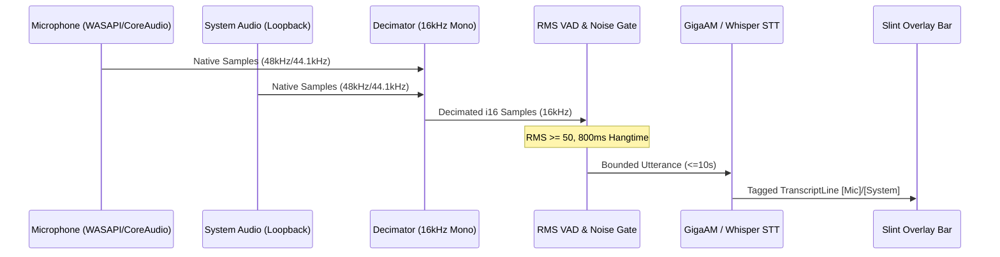
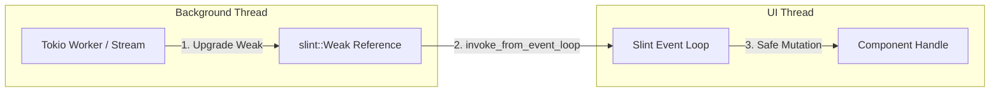

# Subsystem Architecture & Process Topology

## 1. Process Boundaries & IPC Architecture

Suflyor isolates CPU-intensive and native runtime dependencies across distinct OS processes:

## 2. Audio Capture & Resampling Pipeline

## 3. Slint Asynchronous Dispatch & Reactivity

