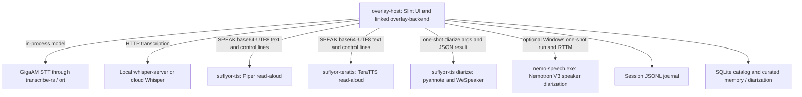

# Process topology: bounded source-verified overview

Reviewed source: `a10c356af05a5832a14ea06a5d0cb6c49694e3f1`. This diagram replaces an earlier incomplete three-process claim and an incorrect "Base64 JSON" TTS label. It is not a complete call graph or native execution test.

```mermaid
graph TD
    Host[overlay-host: Slint UI and linked overlay-backend]
    Host -->|in-process model| Giga[GigaAM STT through transcribe-rs / ort]
    Host -->|HTTP transcription| Whisper[Local whisper-server or cloud Whisper]
    Host -->|SPEAK base64-UTF8 text and control lines| Piper[suflyor-tts: Piper read-aloud]
    Host -->|SPEAK base64-UTF8 text and control lines| Tera[suflyor-teratts: TeraTTS read-aloud]
    Host -->|one-shot diarize args and JSON result| Legacy[suflyor-tts diarize: pyannote and WeSpeaker]
    Host -->|optional Windows one-shot run and RTTM| Nemo[nemo-speech.exe: Nemotron V3 speaker diarization]
    Host --> Journal[Session JSONL journal]
    Host --> Catalog[SQLite catalog and curated memory / diarization]
```

## Source contracts

- [STT resolver](../../../overlay-backend/src/config.rs#L863-L885) selects cloud, Whisper or GigaAM; [backend enum](../../../overlay-backend/src/config.rs#L1071-L1096) distinguishes them.
- [TTS sender](../../../overlay-backend/src/tts.rs#L1252-L1281) emits `SPEAK` plus Base64 UTF-8 text, not JSON chunks. [Control writer](../../../overlay-backend/src/tts.rs#L1437-L1445) flushes a line. Full payload/pipe backpressure remains an open audit topic.
- [Legacy diarization](../../../overlay-backend/src/diarize.rs#L178-L224) runs a separate CLI and consumes segments. [Nemotron path](../../../overlay-backend/src/diarize.rs#L246-L278) is Windows-only and returns speaker intervals, not recognized text.
- [WSOLA](../../../suflyor-wsola/src/lib.rs) is an in-process Rust library consumed by TTS playback and transcript replay, not another process.
- [Data-root resolver](../../../overlay-backend/src/paths.rs#L22-L40) selects the current or legacy product directory. [Catalog default](../../../overlay-backend/src/persistence/sqlite_store.rs#L25-L31) lives under that root.
- Curated [memory](../../../overlay-backend/migrations/0003_memory.sql#L1-L9) and [diarization](../../../overlay-backend/migrations/0006_diarization.sql#L1-L12) are not derived from journals. Deleting the catalog loses those records; reindexing surviving JSONL does not restore them.

## UI thread boundary

Slint component mutation is scheduled on its event loop. Background streaming accumulates state and submits closures; see [delta handling](../../../slint-experiment/src/bin/overlay_host/tile_controller.rs#L537-L608). A Weak handle should be upgraded in the UI closure, not assumed transferable as an upgraded component handle. Generation checks and slot locks do not by themselves prove absence of stale-stream races.

## Limits

Other helpers and local-AI/MLX/Codex processes are outside this small diagram. Audio thresholds, scheduling and platform adapters require their own checked contracts; earlier diagrams are not evidence of live timing correctness. The [speech registry](../reconciliation/speech-models.md) and [Grok register](../reconciliation/candidates.json) retain those boundaries and remaining checks.
