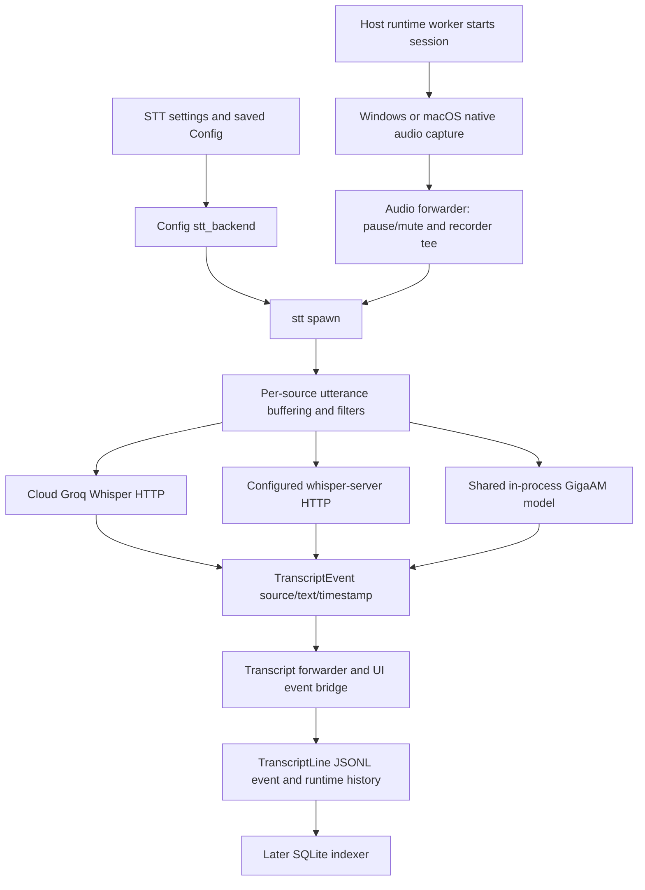

# Live transcription: source-linked feature contract

**Evidence:** source inspection at `a10c356af05a5832a14ea06a5d0cb6c49694e3f1`; no native build, model inference or live UI acceptance executed. This document maps this feature's main production chain, not every line of its modules.

## Entry and configuration

| Surface | Source and contract |
| --- | --- |
| Settings STT tab | [Slint properties/callbacks](../../../slint-experiment/ui/settings_panel.slint#L443-L472), [provider and model controls](../../../slint-experiment/ui/settings_panel.slint#L3655-L3845) |
| Provider index | [Shared mapping](../../../slint-experiment/src/bin/overlay_host/settings_stt.rs#L32-L73): `0=cloud`, `1=gigaam`, `2=whisper` |
| Saved fields | [Config](../../../overlay-backend/src/config.rs#L209-L249): `groq_api_key`, `stt_language`, `stt_cloud_model`, `stt_provider`, `stt_gigaam_dir`, `stt_gigaam_gpu`, Whisper URL/bearer/model |
| Resolver | [Config::stt_backend](../../../overlay-backend/src/config.rs#L863-L885) returns the [Cloud/Whisper/Gigaam enum](../../../overlay-backend/src/config.rs#L1071-L1096); unknown provider falls to cloud in this resolver |
| Runtime startup | [Timer action](../../../slint-experiment/src/bin/overlay_host_windows.rs#L1663-L1675) spawns session start on the shared Tokio runtime; the helper's old UI-thread commentary does not establish current caller threading |
| Recovery startup | [Recovery action](../../../slint-experiment/src/bin/overlay_host/recovery.rs#L307-L317) similarly spawns start-with-recovery |

Defaults and compatibility matter: cloud defaults to `whisper-large-v3`, whereas local/server Whisper's default model text is `whisper-large-v3-turbo`; [managed downloaded local weights](../../../overlay-backend/src/local_ai.rs#L92-L98) are `ggml-large-v3-turbo-q8_0.bin` (874,188,075 bytes), not medium. These values are not proof that a server accepts a requested model ID. See [model inventory](../reconciliation/speech-models.md).

## Execution chain

### Session setup

[Session startup](../../../slint-experiment/src/slint_session.rs#L343-L517) snapshots language/prompt/backend/device configuration, rejects empty cloud credentials, configures and validates GigaAM when selected, creates the journal and optional recorder, starts capture, and tees audio to STT. The audio forwarder supplies a bounded 128-chunk channel and [drops paused/muted input before recording/STT](../../../slint-experiment/src/slint_session.rs#L598-L652). Mic health remains observable even when muted; recording policy differs from health policy.

### Utterance rules

[The shared thresholds](../../../overlay-backend/src/stt.rs#L219-L266) apply to all three backends:

- 16 kHz mono input is supplied by capture adapters.
- Voice RMS threshold: 50; silence hang: 800 ms.
- Per-source cap: 10 seconds; minimum accepted duration: 0.4 seconds.
- At least 25% voiced subwindows and mean RMS at least 60% of voice threshold for the noise gate.
- [Anti-feedback](../../../overlay-backend/src/stt.rs#L379-L445) drops pending input while TTS suppression is active; it is separate from VAD/noise filtering.
- [Post-transcription hallucination filtering](../../../overlay-backend/src/stt.rs#L643-L730) covers common subtitle/outro fragments and repeated-word loops; it is heuristic and can have false positives/negatives.

### Backend and scheduling

[stt::spawn](../../../overlay-backend/src/stt.rs#L287-L375) creates a 64-event output channel, a 30-second HTTP client timeout and a 6-permit semaphore. A normal flush [spawns a task before acquiring the permit](../../../overlay-backend/src/stt.rs#L494-L558). Consequently permits bound active requests, **not** waiting task/PCM memory. Individual utterance bounds do not prove a globally bounded queue.

[transcribe_with_backend](../../../overlay-backend/src/stt.rs#L786-L825): HTTP routes use the configured endpoint/model/bearer, while GigaAM runs `spawn_blocking`, locks the shared model, converts PCM to floats and invokes native inference. [GigaAM caching](../../../overlay-backend/src/stt.rs#L748-L783) is keyed by model-directory string and reset between session starts. Resetting a cached Arc does not prove an already running native call was canceled.

[HTTP retry handling](../../../overlay-backend/src/stt.rs#L829-L955) performs up to three attempts with incremental retry delay, stops on selected permanent statuses and exposes generic transport/status errors instead of response body. No circuit-breaker or global queue budget is established by this loop.

### Platform boundary

[GigaAM shim](../../../overlay-backend/src/stt.rs#L24-L120): Windows chooses DirectML when requested; macOS chooses CoreMl; provider-specific load failure can fall back to CPU. Other platforms fail explicitly. [macOS config migration](../../../overlay-backend/src/config.rs#L1532-L1555) defaults affected older GPU configs to CPU and can migrate retired/unconfigured routes to managed GigaAM. Linux is not a product target.

## Outputs and persistence

`TranscriptEvent` carries source, text and utterance start timestamp ([declaration](../../../overlay-backend/src/stt.rs#L268-L273)). [The host forwarder](../../../slint-experiment/src/slint_session.rs#L654-L788) journals it as `TranscriptLine`, stores live/full transcript histories, emits `transcript:line`, optionally feeds coaching/naming and spawns auto-tiles.

[Indexing](../../../overlay-backend/src/persistence/indexer.rs#L86-L99) preserves `audio_ms` as optional utterance offset; [models](../../../overlay-backend/src/persistence/models.rs#L27-L40) distinguish recording-relative audio time from wall-clock event time. Do not equate either with proven speaker alignment or drift-free capture.

## Declared tests and unexecuted checks

[STT inline tests](../../../overlay-backend/src/stt.rs#L1165-L1643) cover caps, noise/hallucination heuristics, WAV encoding, model selection and error redaction. [Settings mapping/rollback tests](../../../slint-experiment/src/bin/overlay_host/settings_stt.rs#L361-L404) and [forwarder mute tests](../../../slint-experiment/src/slint_session.rs#L1877-L1990) are declared source evidence, not executed passes in this research stage.

Required native acceptance includes actual model load/fallback, mic/system endpoints, pause/mute/no-self-feedback, exact timestamps/order under slow inference, cancellation/restart and source-compatible error/UI redaction. High-priority [Grok candidates](../reconciliation/candidates.json) are STT C01–C04, audio C01–C09 and bridge generation/lifetime checks.
