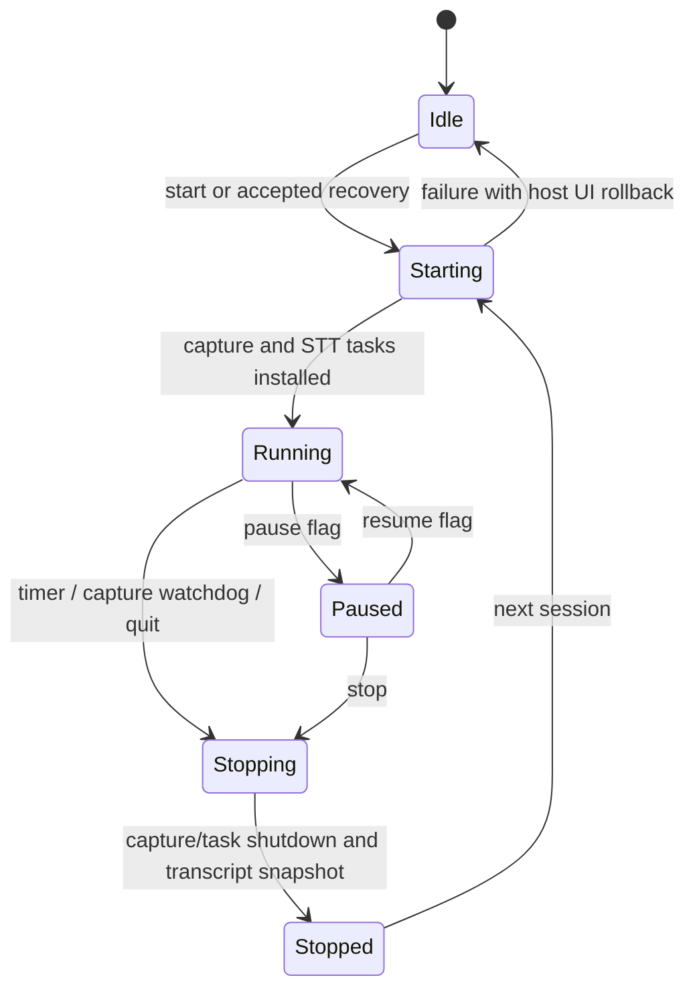

# Session lifecycle and storage: source-linked contract

**Evidence:** source inspection at `a10c356af05a5832a14ea06a5d0cb6c49694e3f1`; no native driver, application UI or crash/fault acceptance executed. This maps start/capture/transcript/stop/index boundaries and documents caller-level counterevidence to historical audit claims.

## Entrypoints and threading

- [Timer start](../../../slint-experiment/src/bin/overlay_host_windows.rs#L1663-L1675) uses `runtime_handle.spawn` before calling synchronous `start_session`.
- [Timer stop](../../../slint-experiment/src/bin/overlay_host_windows.rs#L1711-L1733) uses a worker task before `stop_session_and_maybe_debrief`.
- [macOS stalled-capture watchdog stop](../../../slint-experiment/src/bin/overlay_host_windows.rs#L1741-L1854) dispatches to worker runtime. This is not the meeting-ending hint.
- [Recovery start](../../../slint-experiment/src/bin/overlay_host/recovery.rs#L307-L317) spawns start-with-recovery.
- [Final application cleanup](../../../slint-experiment/src/bin/overlay_host_windows.rs#L4847-L4861) calls stop synchronously **after the event loop returns**; it is not a normal live UI callback.

Therefore the synchronous helper's old UI-thread commentary does not prove normal Start/Stop blocks the Slint thread. Worker-side long mutex/native joins can still delay related work; measure actual caller paths before accepting an inevitable UI-freeze claim.

## Lifecycle

The diagram summarizes intended control flow, not a formally enforced atomic state machine. Config, host AppState and `SlintRuntime` have separate locks/flags, so failed startup/rapid restart requires consistency checks.

### Start and ownership

[start_session_inner](../../../slint-experiment/src/slint_session.rs#L264-L343) clears prior transcript/cache/name state, increments session generation, takes/aborts old tracked tasks and replaces state handles. It snapshots configuration, validates selected backend, creates journal and optional recorder, starts capture and tees output ([setup](../../../slint-experiment/src/slint_session.rs#L343-L517)).

Shared [SlintRuntime](../../../slint-experiment/src/runtime_state.rs#L58-L110) owns capture/journal/health/task handles and transcript/cache state. An Arc clone held by old work is not a guarantee it belongs to the new session. Generation checks exist for auto-tiles but are not universal atomic fences around all writebacks.

### Capture, pause and mic mute

[forward_audio_chunks](../../../slint-experiment/src/slint_session.rs#L598-L652) uses a bounded STT channel and updates health, handles pause/mute before recorder and STT delivery, and offloads recorder Drop. Health freshness is intentionally independent from recording/transcription mute. [Recorder](../../../overlay-backend/src/recorder.rs#L153-L218) uses nonblocking chunk writes and explicit sample/wall-clock placement; queue drops and driver gaps are not magically recovered words.

[transcript_forwarder](../../../slint-experiment/src/slint_session.rs#L654-L788) journals lines, updates rolling/full transcript, coaching/name state, emits events, can emit a meeting-ending **hint**, and may spawn auto-tile work. [The hint's UI handler](../../../slint-experiment/src/bin/overlay_host/tile_controller.rs#L923-L930) changes the status pill to `ending`; it does not stop the session. It loads generation when dispatching work, which needs careful stop/restart interleaving checks; cooperative task abort does not establish no late work.

### Stop and post-meeting work

[stop_session](../../../slint-experiment/src/slint_session.rs#L1396-L1506) takes capture, increments generation, aborts tracked transcript/AI/health tasks, preserves a full transcript snapshot and emits `SessionStop` with counters. It drops the runtime guard before capture Drop and journal shutdown, then schedules indexing.

[Host wrapper](../../../slint-experiment/src/bin/overlay_host_windows.rs#L4895-L4917) passes the stopped snapshot/session identity to optional debrief. [debrief_gate](../../../slint-experiment/src/slint_session.rs#L1550-L1581) checks opt-in, configured active provider, minimum 30-second session and at least five mic lines. This is no longer simply an empty raw cloud bearer check: local configured providers can pass. [Debrief spawn](../../../slint-experiment/src/slint_session.rs#L1585-L1654) emits an independent old-session analysis tile; whether later appearance is inappropriate new-session mutation must be distinguished from intended asynchronous completion.

## Journal delivery and durability

[Journal open/write](../../../overlay-backend/src/journal/writer.rs#L49-L133) creates a per-session JSONL writer and unbounded command channel. Counter increments and fire-and-forget write are not proof the bytes reached durable storage. [Explicit shutdown](../../../overlay-backend/src/journal/writer.rs#L138-L179) sends a control command and waits for flush acknowledgment; other Arc clones do not necessarily prevent that explicit control path from closing the writer.

[Writer loop](../../../overlay-backend/src/journal/writer.rs#L177-L281) flushes and retains first I/O error, but has no observed `sync_all`/`sync_data`. A successful flush ack is not stable-storage power-loss durability. Failing-I/O/torn-line and queue-memory behavior remain a high-priority verified mechanism with unexecuted fault reproduction.

[Retention](../../../overlay-backend/src/journal/retention.rs) prunes journal files by count and byte policy. It does not prove catalog rows should be deleted: the catalog can be the only surviving history after pruning.

## SQLite projection and permanent data

[Index journal](../../../overlay-backend/src/persistence/indexer.rs#L20-L161) reads UTF-8 whole file before tolerant JSON-line projection; invalid UTF-8 can fail the whole file. [Default sweep](../../../overlay-backend/src/persistence/mod.rs#L50-L71) attempts model backfill on existing catalog rows before indexing eligible sessions. Do not claim permanent model-headline drift without accounting for this call.

[Atomic replace](../../../overlay-backend/src/persistence/sqlite_store.rs#L84-L151) replaces session children and explicitly clears FTS rows. [Actual FTS schema](../../../overlay-backend/migrations/0002_fts.sql) supports deleting by stored UNINDEXED session_id; a local Python SQLite fixture executed this successfully, not native bundled rusqlite.

Curated [memory](../../../overlay-backend/migrations/0003_memory.sql) and [speaker diarization](../../../overlay-backend/migrations/0006_diarization.sql) have no session FK cascade and are not rebuildable from journals. Reindexing an existing DB preserves them; **deleting catalog loses them**. This distinction overrides broad rebuildable-index prose.

[Store open](../../../overlay-backend/src/persistence/sqlite_store.rs#L36-L66) enables WAL, FK and busy timeout, performs best-effort pre-migration checkpoint/copy, then migrations. [Maintenance backup](../../../overlay-backend/src/persistence/maintenance.rs#L136-L193) is a separate path using VACUUM INTO and fallback copies; neither path grants an unconditional crash-consistency certification without a test.

## Declared tests and remaining native evidence

[Session tests](../../../slint-experiment/src/slint_session.rs#L1708-L2117) include single-flight, muted audio/recording, health notices, auto-tile prompt inputs, debrief and stop snapshots. [SQLite tests](../../../overlay-backend/src/persistence/sqlite_store.rs#L887-L1403) cover replacement and diarization. These declarations are not executed passes in the research run.

Exact-SHA native checks should cover startup failure rollback, 20 rapid start/stop cycles with delayed model/name/debrief replies, paused/muted recorder contents, thread/process lifetime after quit, failing journal writes, WAL migration/restore with curated data and privacy-safe visible diagnostics. The [original Grok register](../reconciliation/candidates.json) retains mechanisms, hypotheses and rejected blanket claims separately.
