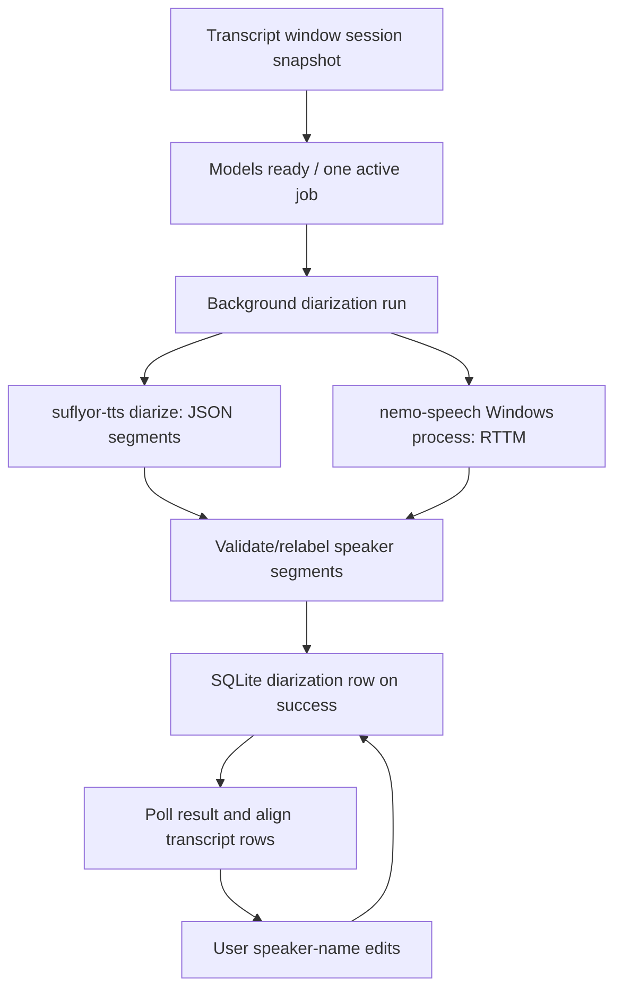

# Speaker diarization: source-linked feature contract

**Evidence:** source inspection at `a10c356af05a5832a14ea06a5d0cb6c49694e3f1`. No native diarization run, live UI test or release acceptance was executed here. This feature labels who spoke in recorded system audio; it does not replace speech-to-text recognition.

## User entry and transient state

The transcript/archive window exposes [manual/automatic speaker count and optional Nemotron toggle](../../../slint-experiment/ui/transcript.slint#L464-L606). [wire_diarization](../../../slint-experiment/src/bin/overlay_host/aux_windows/transcript.rs#L890-L984) captures the requested session and utterances, resets the toggle to false on wiring and reattaches an existing active job instead of spawning another. Engine choice is per-run window state, not a persistent STT provider.

[Readiness presentation](../../../slint-experiment/src/bin/overlay_host/aux_windows/transcript.rs#L519-L571) differentiates engine availability. The [run callback](../../../slint-experiment/src/bin/overlay_host/aux_windows/transcript.rs#L1135-L1232) snapshots engine/count and prevents duplicate active jobs. Engine install readiness and UI enabled state are not proof of native executable/model compatibility.

## Main chain

### Legacy path

[run_diarization_with_engine](../../../overlay-backend/src/diarize.rs#L162-L244) locates the recorded `system.wav`, checks models and WAV duration, then runs legacy pyannote segmentation/WeSpeaker embedding in a separate `suflyor-tts diarize` process. Automatic speaker count tests a bounded candidate range with stability checks; the numerical range alone is not a native runtime-duration bound.

[run_sidecar](../../../overlay-backend/src/diarize.rs#L397-L426) synchronously calls `Command::output` with hidden console, parses success stdout and rejects nonzero status. Unlike Nemotron, this legacy helper has no visible process elapsed-time watchdog or cancellation check during the native call. The window's cancel flag is not proof that legacy native inference stops promptly.

### Optional Nemotron V3 path

[run_nemotron](../../../overlay-backend/src/diarize.rs#L246-L278) is Windows-only, verifies availability and WAV existence, calls `guard_wav_len` and passes cancellation to the isolated runner. Its model ID and RTTM intervals represent speaker segmentation, not recognized words.

[Runner](../../../overlay-backend/src/nemotron_diar.rs#L15-L125): model path/hash readiness, hidden child, lifetime JobObject, bounded stderr lines, cancel polling and three-hour elapsed-process cap. It waits on the child, joins log reading and removes temporary output after successful file read before RTTM parsing; timeout/cancel paths do not establish that every crash/cancel residue is removed. That cleanup boundary remains a check, not a claimed guarantee.

[RTTM parser](../../../overlay-backend/src/nemotron_diar.rs#L125-L151) rejects wrong row shape/nonfinite/out-of-range intervals, assigns display IDs in arrival order and sorts accepted segments. [Legacy windows/alignment](../../../overlay-backend/src/diarize.rs#L429-L558) maps system utterances by their `audio_ms`, caps each line ownership to 30 seconds and requires overlap; mic rows remain labeled independently.

### Duration and timeline

[guard_wav_len](../../../overlay-backend/src/diarize.rs#L357-L373) inspects WAV header duration and rejects over three hours. This is **recording length**, distinct from the Nemotron elapsed-process cap. [timeline_reliable](../../../overlay-backend/src/diarize.rs#L83-L118) warns when the recording is substantially shorter than inferred transcript timeline. A reliable flag is a heuristic compatibility check, not proof of exact drift-free speech alignment.

## Assets, installation and release

[Legacy readiness](../../../overlay-backend/src/diar_install.rs#L139-L212) requires an install marker with matching model pins and present nonempty model files. [Installer](../../../overlay-backend/src/diar_install.rs#L215-L267) downloads/verifies to staging, publishes compatible assets and marker last. Do not equate sentinel checks with rehashing every model byte on every use.

[Nemotron readiness/install](../../../overlay-backend/src/diar_install.rs#L386-L483) validates a pinned 107,012,128-byte GGUF and CLI presence. Vendored Windows runtime files are hash-checked in [build packaging](../../../scripts/build-slint-release.ps1#L75-L109), and [NSIS](../../../scripts/slint-installer.nsi#L68-L83) includes executable/DLLs and notices, not the model weights.

The [speech/model inventory](../reconciliation/speech-models.md) records actual Git history, source pins and separate runtime/model license limits. Latest observed published RC predates Nemotron addition; a task-branch RC4 version string is not a published release.

## Persistence and retained user data

[Background worker](../../../slint-experiment/src/bin/overlay_host/aux_windows/transcript.rs#L1175-L1221) runs analysis, then `Store::put_diarization` only after success; error paths do not intentionally replace a good row. Closing/reopening the window retains active job state and can reattach result polling. [Success polling](../../../slint-experiment/src/bin/overlay_host/aux_windows/transcript.rs#L640-L697) applies names/segments only to a matching session window. A successful rerun produces empty `speaker_names` and [replaces the persisted row](../../../overlay-backend/src/persistence/sqlite_store.rs#L284-L305); previous manual names are not automatically merged by this path. This is a source-visible data-lifecycle concern beyond simply preserving a good row on failure.

[Catalog API](../../../overlay-backend/src/persistence/sqlite_store.rs#L243-L320) reads/writes JSON segments and user-renamed speaker names. [Diarization schema](../../../overlay-backend/migrations/0006_diarization.sql) explicitly treats this as user-owned analysis, not reconstructed JSONL projection. Full catalog deletion loses it. `get_diarization` currently propagates malformed JSON errors despite earlier rustdoc claiming `None`; concurrent rename read/modify/write remains a race hypothesis.

## Declared verification and outstanding acceptance

[RTTM tests](../../../overlay-backend/src/nemotron_diar.rs#L154-L190), [timeline/alignment/count tests](../../../overlay-backend/src/diarize.rs#L560-L750) and [Nemotron pin test](../../../overlay-backend/src/diar_install.rs#L505-L522) are source-declared, not executed native evidence here.

Acceptance needs exact-SHA Windows installer/model download, runtime and cancel/failure behavior, preserved prior results after failed run, same-session polling on close/reopen, rename persistence, speaker count modes, overlapping speech and native screenshot/functional evidence. macOS should honestly reject Nemotron while preserving its supported legacy path; do not add unsupported Linux product claims.
