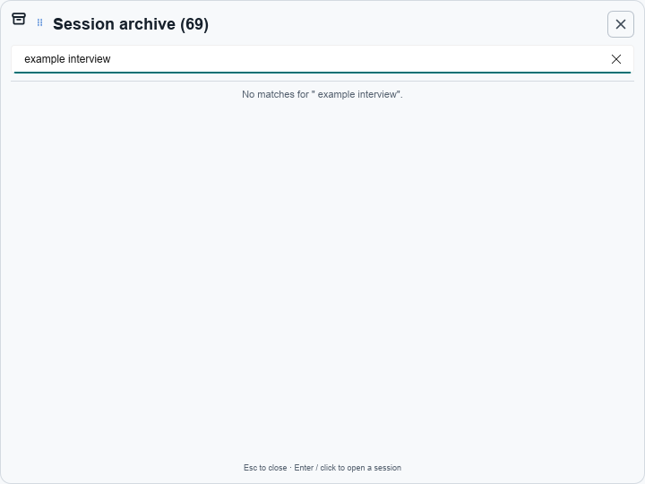

# README screenshot audit — 2026-08-03

Checked the eight images embedded by `README.md` against the v0.35.3 UI.

| Screenshot | Result |
|---|---|
| Four overlay-bar themes | Current: English and using the current bar controls and drag grip. The refreshed Light Frost capture visibly names the active local stack: GigaAM GPU + Gemma 26B-A4B. |
| `setup-wizard.png` | Current: English seven-step wizard from v0.35.3. |
| `settings-stt-cloud.png` | Current: English STT provider/model selection from v0.35.3. |
| `tile-empty.png` | Replaced: it used the older tile chrome and Russian copy. The new `tile-answer.png` shows the current English tile, drag grip, actions, follow-up field, and answer layout. |
| `session-archive.png` | Replaced: the previous empty-state capture predated the current archive header and drag grip. The final privacy-safe English no-match state demonstrates archive search without exposing locale-specific timestamps or session text. |

The two replaced images can be compared with their [v0.35.3 pre-fix tile](https://github.com/PavelLizunov/suflyor/blob/28811ff/docs/showcase/tile-empty.png) and [v0.35.3 pre-fix archive](https://github.com/PavelLizunov/suflyor/blob/28811ff/docs/showcase/session-archive.png).

## Archive header alignment

The 26 px drag-grip slot started at the top of a 30 px header row, placing its SVG above the title's optical centre. It now sits in a fixed 30 px wrapper with a 4 px top offset. A populated-list pass also centred every summary action vertically and reserved a 14 px content gutter so the scrollbar no longer paints over row borders or buttons.

| Before | After |
|---|---|
|  |  |

Both captures use the English interface, Light Frost theme, a 720×540 archive window, and the same privacy-safe `example interview` no-match query.

## Visible model identity

The old Light Frost bar capture named only the cloud STT route. The replacement
uses the same English Light Frost surface and visibly shows the active local STT
and AI models. This avoids claiming a model in alt text that the screenshot does
not actually display.

| Before | After |
|---|---|
|  |  |
