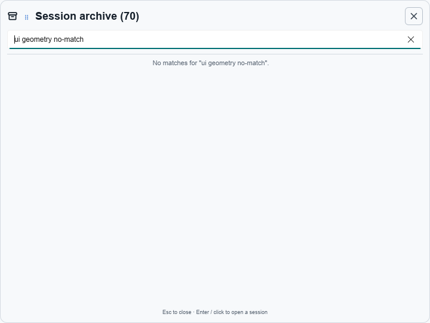
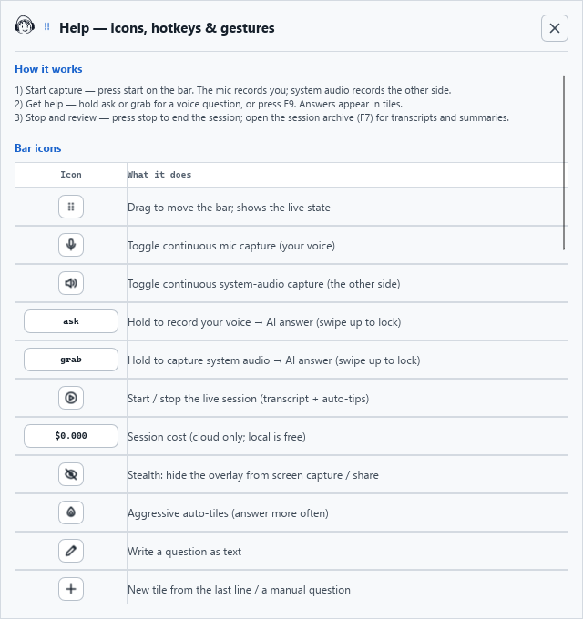
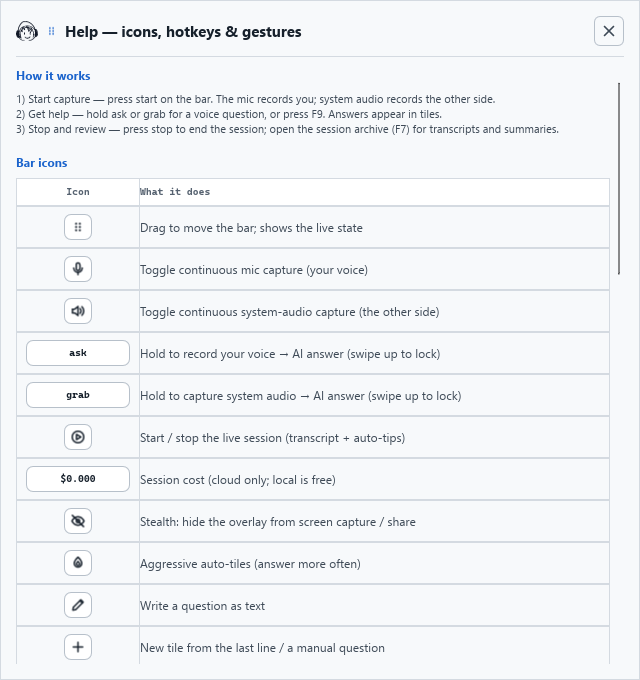
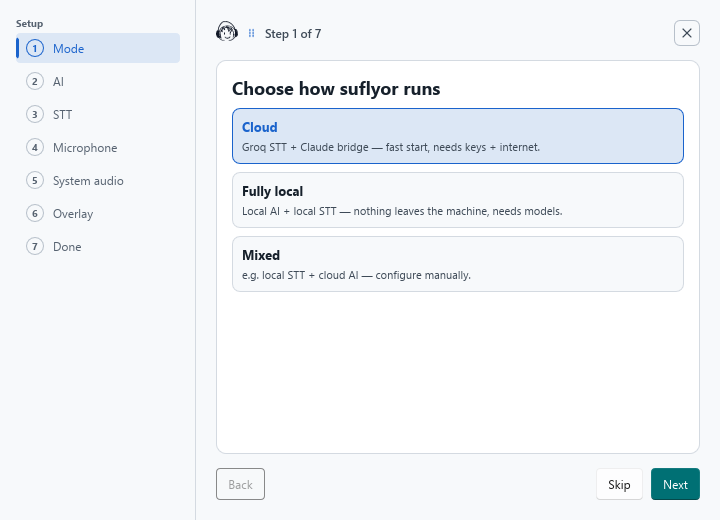
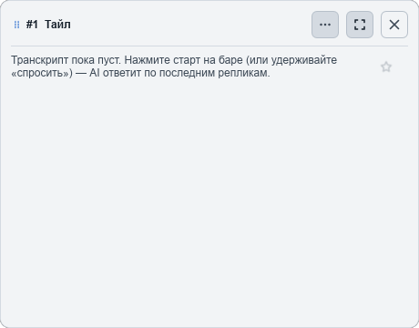
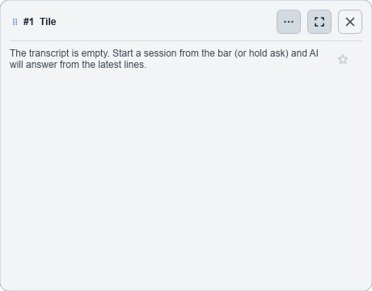
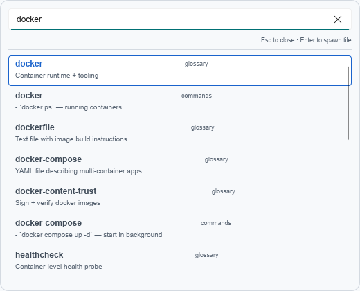
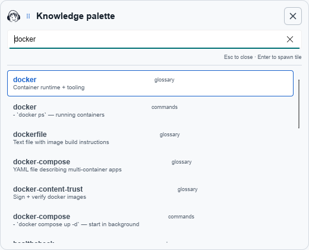

# UI visual regression audit — 2026-08-03

This audit applies the repository's Slint MCP visual gate to the header,
scrolling, localization, and empty/populated states reported in the archive
and related auxiliary windows.

Validated QA binary SHA-256:
`67A26C29226452C7644CA9216F3062A8BB2DEE6E23CE8908883F651CABF665BF`.
It identified itself as `slint-mcp-embedded` and exposed the expected 14 tools.
Captures use 100% scale, Light Frost, and the window sizes shown in the images.

## Repeatable method

1. Build the exact branch with both `SLINT_EMIT_DEBUG_INFO=1` and
   `--features ui-mcp`; record the binary SHA-256.
2. Capture the baseline before the first edit. Repeat the same viewport,
   scale, theme, language, test data, query, selection, and scroll position
   after the edit.
3. Exercise a state matrix, not only the default screen: empty, populated,
   selected, no-match, scrolled, minimum supported size, English, and Russian.
4. Inspect the live MCP element tree and apply numeric gates:
   - header controls share one vertical centre (maximum 2 px optical offset);
   - interactive controls have at least 4 px separation from borders and
     neighbouring actions;
   - scrollbars have their own gutter and never cover text, buttons, or the
     selected-row outline;
   - clipped text, overlapping hit targets, and mixed-language copy are
     blocking defects.
5. Verify behaviour: Close, drag, search, selection, scrolling, and every
   changed action. Then run the complete 13-shortcut global-hotkey smoke.
6. Save privacy-safe before/after screenshots, run the full repository gate,
   and record anything that could not be verified. A compile-only result is
   not visual approval.

The permanent checklist and detailed command sequence live in
[`../regression-checklist.md`](../regression-checklist.md) and
[`../../.agents/skills/slint-mcp-ui-audit/SKILL.md`](../../.agents/skills/slint-mcp-ui-audit/SKILL.md).

## Measured header geometry

All values are vertical centres in logical pixels, measured from the live MCP
element tree at 100% scale.

| Surface | Before | After | Result |
| --- | --- | --- | --- |
| Session archive | archive icon 21; title/Close 27; grip 29 | icon/title/Close 27; grip 29 | fixed; grip keeps intentional +2 px optical offset |
| Help | brand 27; grip 29; title 30; Close 31 | all 31 | fixed |
| Setup wizard | brand 31; title/grip/Close 33 | all 33 | fixed |
| Ask window | pencil 23; grip/title 24; Close 29 | all 29 | fixed |
| Knowledge palette | no header or drag affordance | brand/grip/title/Close 27 | shared header added |
| Recovery offer | title without drag affordance | grip/title/Close 31 | fixed; private runtime screenshot kept outside the checkout |

## Before and after

| Surface/state | Before | After |
| --- | --- | --- |
| Session archive, no matches |  |  |
| Help, long scrollable content |  |  |
| Setup wizard |  |  |
| New empty tile, English UI |  |  |
| Knowledge palette, selected and scrolled |  |  |

## Findings applied

- Normalized auxiliary-window headers around the existing brand, grip, title,
  and Close primitives instead of introducing another component family.
- Reserved a 14 px right gutter in long scrollable surfaces so the scrollbar
  cannot cover content or selection borders.
- Added the missing user-facing header and drag affordance to the knowledge
  palette and recovery offer.
- Localized Rust-built new-tile text, eliminating Russian copy in English UI
  and the duplicated sequence number in the title.
- Shortened the palette search placeholder after the Russian 520 px check
  exposed clipping, and localized the Rust-built Ask-window profile label.

Two independent read-only Qwen 3.8 audits were saved in the stable worker
artifact store outside the checkout. Their static findings were checked
against live MCP geometry before inclusion; unconfirmed layout guesses were
not applied.

The Ask-window geometry was measured before/after, but its screenshots are not
published because the live label contains the owner's active profile name.
English and Russian copy were checked live, including `Profile:` and the new
tile's empty state. The complete global-hotkey smoke remains unverified in this
run because a Windows security prompt from another process blocked safe
system-level input; it must be repeated before merge.
