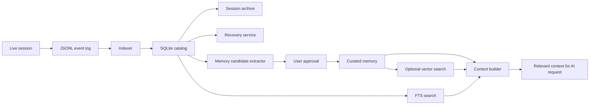

# Локальный архив сессий и персональная память

Дата решения: 2026-06-02.

Статус: архитектурная идея для обсуждения. Код пока не менять.

## Зачем это нужно

Приложение уже сохраняет богатый JSONL-журнал каждой сессии:

- реплики микрофона и системного звука;
- AI-запросы и ответы;
- цели запросов, модели, latency и стоимость;
- события тайлов;
- итоговую статистику.

Этого достаточно, чтобы сделать:

1. восстановление незавершенной сессии после аварийного restart;
2. локальный архив диалогов с поиском;
3. накопление полезной персональной памяти;
4. обогащение профилей;
5. выбор нескольких релевантных фрагментов истории перед новым AI-запросом.

Важно не смешивать эти задачи в один большой модуль.

## Основное архитектурное решение

Оставить JSONL как первичный append-only журнал событий. Добавить SQLite как
локальную индексированную проекцию поверх журналов.



### Почему два слоя, а не только база данных

JSONL уже хорошо подходит для live-сессии:

- запись последовательная и дешевая;
- переживает аварийное завершение;
- легко читать вручную;
- не требует миграции схемы для каждого нового события;
- не блокирует аудио и AI pipeline.

SQLite решает другой класс задач:

- быстрый поиск;
- фильтрация по профилю, дате и типу события;
- нормализованные связи;
- миграции;
- статусы сессий;
- подготовка памяти и контекста;
- последующая векторизация.

JSONL считать сырым источником фактов. SQLite считать восстанавливаемым локальным
индексом и продуктовым хранилищем для пользовательских метаданных.

## Выбранный стек

### База данных

Использовать SQLite:

- один локальный файл;
- транзакции;
- foreign keys;
- режим WAL;
- встроенный FTS5 для полнотекстового поиска;
- отсутствие отдельного сервера;
- зрелый формат, который легко инспектировать и переносить.

Это соответствует характеру приложения: Windows desktop, один пользователь,
локальные данные, умеренный объем записей.

### Rust-адаптер

Предпочтительный первый вариант: `rusqlite` с bundled SQLite.

Почему:

- тонкий и предсказуемый слой над SQLite;
- не требует ORM;
- подходит для локальной single-user базы;
- SQL остается явным;
- bundled-сборка не зависит от наличия SQLite DLL на компьютере пользователя.

Не добавлять ORM на старте. Не добавлять отдельную vector-БД на старте. Не
переводить persistence на распределенную или серверную модель.

### Декларативные миграции

Схему хранить в неизменяемых SQL-файлах:

```text
overlay-backend/migrations/
  0001_session_catalog.sql
  0002_memory_items.sql
  0003_fts.sql
  0004_embeddings.sql
```

Правила:

- примененные migration-файлы не переписывать;
- перед миграцией делать backup SQLite-файла;
- хранить номер схемы в таблице миграций или `PRAGMA user_version`;
- при ошибке миграции оставлять предыдущую базу рабочей;
- уметь пересобрать индекс из JSONL.

## Модульные границы

Новые технологии должны входить через узкие интерфейсы. UI и orchestration не
должны напрямую писать SQL или вычислять embeddings.

Предлагаемая структура:

```text
overlay-backend/src/
  persistence/
    mod.rs
    models.rs
    event_log.rs
    sqlite_store.rs
    migrations.rs
    indexer.rs
  recovery/
    mod.rs
  memory/
    mod.rs
    candidates.rs
    repository.rs
    context_builder.rs
    retrieval.rs
    embeddings.rs
```

Ответственность:

- `event_log`: существующая надежная JSONL-запись.
- `sqlite_store`: соединение, транзакции и запросы SQLite.
- `migrations`: версия схемы, upgrade и backup.
- `indexer`: идемпотентно переносит события JSONL в SQLite.
- `recovery`: ищет незавершенные сессии и готовит восстановление.
- `candidates`: извлекает предложения для персональной памяти.
- `repository`: CRUD для подтвержденной памяти.
- `retrieval`: единая точка поиска релевантных фрагментов.
- `embeddings`: сменяемый provider для embeddings.
- `context_builder`: собирает ограниченный контекст для нового AI-запроса.

`overlay_host.rs` должен только вызывать эти сервисы и отображать состояние.
Это хороший повод начать разрезание текущего orchestration-файла.

## Минимальная схема данных

### Сессии

```text
sessions
  id
  journal_path
  started_at
  finished_at
  status              # active | completed | crashed | recovered | excluded
  profile_id
  summary
  transcript_chars
  ai_turns_count
  total_cost_microcents
  indexed_at
```

### Реплики

```text
utterances
  id
  session_id
  unix_ms
  source              # mic | system
  text
```

### AI-диалоги

```text
ai_turns
  id
  session_id
  unix_ms
  purpose
  model
  question
  answer
  latency_ms
  attached_screenshot
```

### Подтвержденная память

```text
memory_items
  id
  profile_id
  kind                # experience | preference | answer | weak_topic | note
  text
  source_session_id
  approved_at
  archived_at
  embedding_status
```

### Предложения для памяти

```text
memory_candidates
  id
  profile_id
  source_session_id
  kind
  text
  reason
  status              # pending | approved | rejected
  created_at
```

### Embeddings

```text
embeddings
  memory_item_id
  provider
  model
  dimensions
  vector_blob
  updated_at
```

## Модель персональной памяти

Не складывать сырой транскрипт напрямую в профиль.

Разделить три уровня:

1. **Сырые события**  
   Полный локальный журнал. Нужен для истории, восстановления и повторной
   индексации.

2. **Кандидаты в память**  
   AI или локальная эвристика предлагают полезные фрагменты:
   опыт, технологии, часто задаваемые вопросы, удачные ответы, пробелы в знаниях.

3. **Подтвержденная память**  
   Только вручную одобренные элементы участвуют в долговременном контексте
   профиля.

Это сохраняет управляемость: пользователь видит, что именно приложение о нем
запомнило, и может удалить или отредактировать каждый элемент.

## Поиск и векторная база

### Этап 1: без embeddings

Начать с SQLite FTS5:

- поиск по архиву сессий;
- поиск по AI-вопросам и ответам;
- фильтр по профилю;
- поиск по подтвержденной памяти;
- BM25 ranking.

Для первых сотен и тысяч записей этого достаточно.

### Этап 2: embeddings внутри SQLite

Когда обычного поиска станет мало:

- векторизовать только `memory_items` и качественные Q/A;
- не векторизовать весь сырой транскрипт автоматически;
- хранить provider, model и dimensions рядом с embedding;
- уметь пересчитать embeddings при смене модели;
- оставить FTS fallback.

Для небольшого локального архива можно начать с вычисления cosine similarity в
Rust. Специализированный индекс подключать только после измерения реального
объема и latency.

### Этап 3: опциональный vector extension

Если данных станет действительно много, рассмотреть SQLite vector extension,
например `sqlite-vec`. Подключать его только внутри `retrieval`-модуля.

Не связывать остальную архитектуру с конкретным vector engine.

### Чего не делать сейчас

- не поднимать Qdrant, Milvus, Weaviate или отдельный Postgres;
- не добавлять внешний сервис только ради локальной памяти;
- не отправлять embeddings в облако без явного согласия;
- не превращать каждый AI-запрос в чтение всего архива.

## Сборка контекста

`context_builder` должен собирать небольшой и понятный пакет:

```text
base profile context
+ approved memory items relevant to current question
+ selected prior Q/A
+ current live transcript window
```

Нужны жесткие лимиты:

- максимальное число фрагментов;
- token budget;
- дедупликация;
- приоритет свежих и подтвержденных данных;
- объяснимость: возможность показать, какие элементы памяти были использованы.

## Восстановление после аварийного restart

### Как определить незавершенную сессию

При старте:

1. найти последний JSONL с `session_start`;
2. проверить отсутствие `session_stop`;
3. сверить статус SQLite;
4. предложить восстановление.

### Что восстанавливать

- профиль;
- последние реплики транскрипта;
- краткое локальное summary;
- последний завершенный вопрос и ответ;
- ссылку на журнал.

### Что не восстанавливать автоматически

- незавершенный сетевой запрос;
- запись микрофона;
- screenshot payload;
- открытые тайлы один в один;
- старый streaming state.

После подтверждения начать новую live-сессию, но связать ее с предыдущей через
`recovered_from_session_id`.

## Приватность и жизненный цикл данных

Архив диалогов чувствительнее текущего config-файла. Нужны явные настройки:

- хранить архив: on/off;
- срок хранения или лимит размера;
- исключить текущую сессию из памяти;
- удалить одну сессию;
- удалить весь архив;
- экспортировать выбранные сессии;
- пересобрать индекс;
- очистить embeddings;
- cloud embeddings: только opt-in;
- F8 изображения: не хранить по умолчанию.

Отдельно решить, требуется ли шифрование локальной базы. Минимальный вариант:
локальный файл внутри профиля Windows и четкое предупреждение. Более сильный
вариант: SQLCipher или другой слой шифрования, но только после отдельного
исследования сложности сборки и восстановления.

## План реализации

### Phase 0 — разрезать orchestration

- Начать выносить из `overlay_host.rs` lifecycle, diagnostics, updater, wizard и
  capture flow.
- Зафиксировать границы модулей до добавления базы.

### Phase 1 — recovery без SQLite

- На старте обнаруживать JSONL без `session_stop`.
- Показывать предложение восстановить контекст.
- Добавить тесты graceful stop, crash и restart.

### Phase 2 — SQLite catalog

- Добавить `rusqlite` bundled.
- Добавить SQL migrations.
- Индексировать существующие JSONL идемпотентно.
- Сделать список сессий и базовый поиск FTS5.

### Phase 3 — управляемая персональная память

- Извлекать `memory_candidates`.
- Добавить approve/reject/edit.
- Подмешивать только approved memory через `context_builder`.

### Phase 4 — embeddings

- Добавить сменяемый embedding provider.
- Начать с local embeddings.
- Измерить качество FTS против hybrid retrieval.
- Только после измерений решить, нужен ли vector extension.

## Критерии хорошей архитектуры

- Live-аудио и AI pipeline не зависят от скорости SQLite.
- JSONL остается читаемым и достаточным для восстановления.
- SQLite можно удалить и пересобрать из журналов без потери сырой истории.
- UI не содержит SQL.
- `overlay_host.rs` не становится владельцем persistence-логики.
- Vector engine можно заменить без переписывания архива и профилей.
- В профиль попадает только подтвержденная память.
- Пользователь может увидеть и удалить все накопленные данные.

## Открытые решения

Перед реализацией ответить:

1. Архив включен по умолчанию или требует opt-in?
2. Хранить все сессии или только явно отмеченные?
3. Нужен ли отдельный профиль памяти для каждого типа собеседования?
4. Достаточно ли защиты профилем Windows или база должна быть зашифрована?
5. Какие embeddings допустимы: только local или cloud тоже с opt-in?
6. Какой лимит хранения разумен: число сессий, размер или срок?
